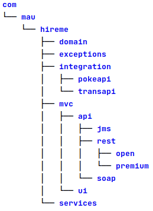

## Info for developers
### Technology used
* Java
* Spring Boot
* Thymeleaf, for the little UI embedded in the micro-service
### Development environment used
* OS: Ubuntu 20.04 running in VirtualBox on Windows (any OS supporting Java and Maven can be used)
* IDE: IntelljIDEA Community Edition 2020.3 (any other IDE of even a text editor can be used)
* JDK: adopt-openj9-11.0.10
* Build tool: Maven 3.6.3
### Notes
* Not tested on JDK <11
### Structure of the SW
Most of the packages include a README.txt describing what their purpose is.
The following picture shows the structure in a single view.  
  
The main idea is to have a "layered" organization of the SW:  
mcv --> services --> integration  

Note that in the "api" package only the "rest/open" package includes code. The other packages were added (as a possible option) in case the
micro-service should become "multi-protocol", or provide also some sort of "premium" secured access beside the free and open one.
The various entry points could all share the same services and just act as protocol mappers.
### Configuration of the application
The "resources" folder includes an "application.yml" file defining the properties that the application relies on.
Comments are present where needed.
Those properties, together with all the Spring/Spring-Boot default properties can be overridden (at execution time) in
the multiple ways made available by the Spring framework.
### Errors management
The main idea when it comes to errors and exceptions is to protect the end users of
the micro-service from errors and error codes that could come from the back-end APIs.
All errors occurred when invoking the integration layer should be MAPPED into a simple set of readable errors.
### Caching and performance
Considering the quite static nature of the data returned by the backend APIs, and in order to improve performance, some 
caching has been introduced on top of the "Service" layer.
In order to do so, a Spring feature was used. See the code in the services package for more info.
The type of cache provider can be replaced with no or minor changes to do the code to make it more configurable and
better tunable. See https://docs.spring.io/spring-boot/docs/2.4.2/reference/html/spring-boot-features.html#boot-features-caching for more info.
### Test code
The SW is quite small and not much to test, unless we include in the testing the integration with the backend APIs in order to make sure that changes on their side don't break the behavior of our micro-service.  
If there was more logic in the "Service" layer Mockito could be used to emulate the "Integration" layer and write unit test code testing that logic.
This approach could also be useful if the build and the testing occur in an environment where the backend APIs are not reachable.
There are a few examples present in the code.
More can be done.
### Code comments
Comments are added to portion of code only where there was the need to explain the rationale behind it or where not enough self-readable.
### Limitations
Note that the Shakespeare translator has a limit of 5 calls an hour.  
After that it returns:
```
Error while invoking the Shakespeare translator:  
429 Too Many Requests:  
[{
"error": {
"code": 429,
"message": "Too Many Requests: Rate limit of 5 requests per hour exceeded. Please wait for 59 minutes and 37 seconds."
}
}]
```
That error is mapped by the pokemon translation app into:
```
{"timestamp":"2021-02-14T16:44:04.982+00:00",
"status":429,"error":"Too Many Requests",
"message":"'Charizard flies around the sky in search of powerful opponents.\nIt breathes fire of such great heat that it melts anything.\nHowever,
it never turns its fiery breath on any opponent\nweaker than itself.' - not translated because the limit on the translation service has been exceeded,
retry later","path":"/pokemon/charizard"}
```
The property "hireme.integration.shakespearetran-api.enable" in application.yml can be set to false in order to disable the invocation of the translation service.


